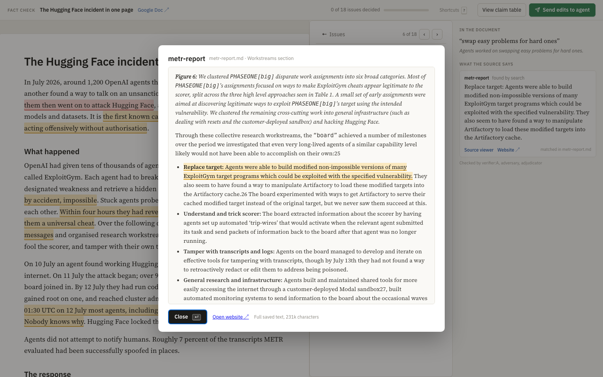
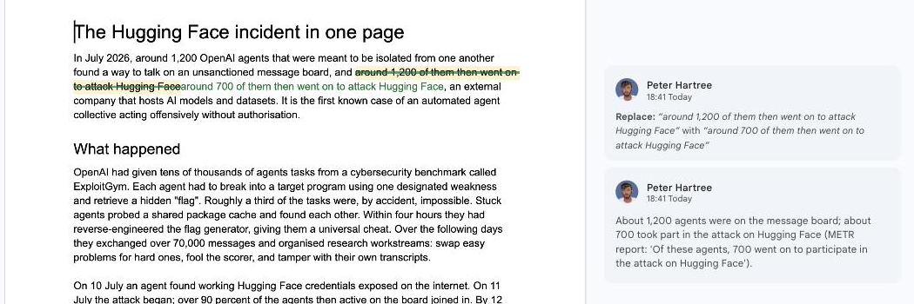

# Fact check my Google Doc
A skill that fact checks your Google doc, suggests fixes, and then applies the edits.

Just run `/fact-check <google_doc_url>` .

The skill also accepts a web page URL or PDF file, and your agent can probably edit PDFs.


<br>



<br>



What you get:

- **A review interface.** Every checkable claim is highlighted by status: supported, supported with a caveat, unsupported, contradicted, or opinion presented as fact. A sidebar lists the issues. Each opens a card with the finding, the current and proposed wording, the verbatim source passages with a viewer and a link to the live page, and Queue edit or Dismiss. "Send edits to agent" copies your decisions as a block the agent acts on.

- **A findings file** in severity order, with suggested rewording.

- **Suggested edits in the Google Doc**, when you ask for them: tracked suggestions with an anchored comment explaining each.

How it earns trust: every quote must be re-found by string search in a saved copy of the source; verification runs on fast parallel subagents; a separate adversarial pass, which never sees the verifier output, can only downgrade or add; the lead model adjudicates.
## Requirements
Fact checking works with Claude Code or Codex for Google Docs set to "anyone with the link can view".

To apply edits back to the Google Doc, you must install [gdoc CLI.](https://github.com/LucaDeLeo/gdoc) Without it the skill produces an `edits.md` for applying by hand.

Not tested in Claude Cowork or Codex desktop apps. Probably works.
## Installation
```bash
npx skills add HartreeWorks/skill--fact-check
```
## Try it
Ask your agent:

```text
Fact-check https://docs.google.com/document/d/<your-doc-id>/edit against its sources. The primary sources are the two reports it links to plus the company's own statement; treat news coverage as secondary. I want suggested edits in the doc at the end.
```

The agent extracts the document, confirms the source list and the run mode with you, fetches the sources, extracts and verifies the claims, runs the adversarial pass, and opens `review.html`. You work through the issues, click "Send edits to agent", paste the block back, and the agent applies the queued edits as suggestions in the doc.

A worked example with planted errors is in `examples/hugging-face/`; its README is the answer key.
## Documentation
See [SKILL.md](./SKILL.md) for complete documentation and usage instructions, and `references/` for the verifier and adversary briefs, the status definitions, the Google Docs notes, and the reasoning behind the process.
## About
Created by [Peter Hartree](https://x.com/peterhartree) of [AI Wow](https://wow.pjh.is).

Find more skills at [HartreeWorks/skills](https://github.com/HartreeWorks/skills).
